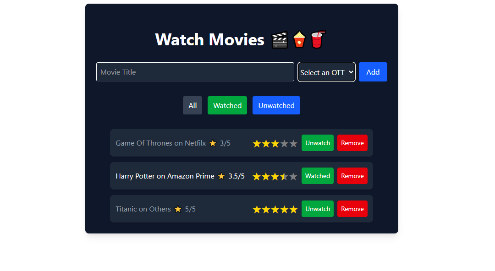

🎬 Movie Watchlist - React Project

Overview

Movie Watchlist is a React-based web application that allows users to manage their personal movie watchlist.
This project focuses on Immutable State Updates in React, ensuring that state is never mutated directly and the UI always updates predictably.

Users can:

Add new movies to their watchlist

Rate movies

Toggle watched/unwatched status

Delete movies

Filter movies by All / Watched / Unwatched

Persist their watchlist using localStorage

🛠 Features

Immutable State Management

State updates (add, rate, toggle, delete) are performed immutably using the spread operator, map, and filter.

Prevents direct mutation of state, making the app predictable and bug-free.

Movie Filtering

Filter movies by All / Watched / Unwatched.

Filtering does not mutate the original movies array.

Persistent Storage

Movies are saved in localStorage, so the watchlist persists even after refreshing the page.

User-Friendly UI

Built with Tailwind CSS for a clean, responsive interface.

Each movie shows title, OTT platform, rating, and watched status.

Star Rating Integration

Users can rate movies using stars with react-rating-stars-component.

⚡ Key Concepts
Immutable State Updates

Add a movie:

setMovies([...movies, newMovie])

Update rating:

setMovies(movies.map(movie =>
  movie.id === id ? { ...movie, rating } : movie
))

Toggle watched status:

setMovies(movies.map(movie =>
  movie.id === id ? { ...movie, watched: !movie.watched } : movie
))

Delete a movie:

setMovies(movies.filter(movie => movie.id !== id))

These techniques ensure the original state is never mutated, which is a best practice in React development.

📂 Project Structure
public/images/WatchMovies.PNG
src/
├─ components/
│  ├─ Heading.jsx
│  ├─ MovieForm.jsx
│  ├─ MovieList.jsx
│  ├─ MovieItem.jsx
│  └─ Filter.jsx
├─ MovieWatch.jsx
├─ index.jsx
└─ App.jsx

MovieWatch.jsx → Main component handling state and logic.

MovieList.jsx & MovieItem.jsx → Display movies and handle actions.

Filter.jsx → Filter buttons (All / Watched / Unwatched).

MovieForm.jsx → Add new movies.

🚀 How to Run

Clone the repository:

git clone <your-repo-url>

Install dependencies:

npm install

Start the development server:

npm run dev

Open your browser at http://localhost:5173 (Vite default).

📌 Dependencies

React 19

Tailwind CSS

react-rating-stars-component (star rating)

💡 Notes

Demonstrates best practices for state management in React.

Immutable updates make the app predictable and prevent bugs.

localStorage ensures data persistence without a backend.

🎯 Future Improvements

Persist selected filter in localStorage.

Add search functionality for movies.

Add edit functionality to modify movie details.

Use React Context or Redux for larger state management.

Author: Asraful Islam Sabbir
Date: December 2025